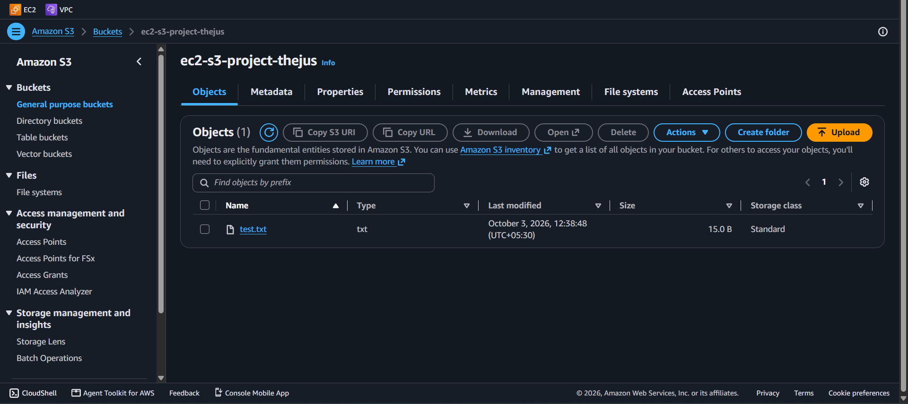
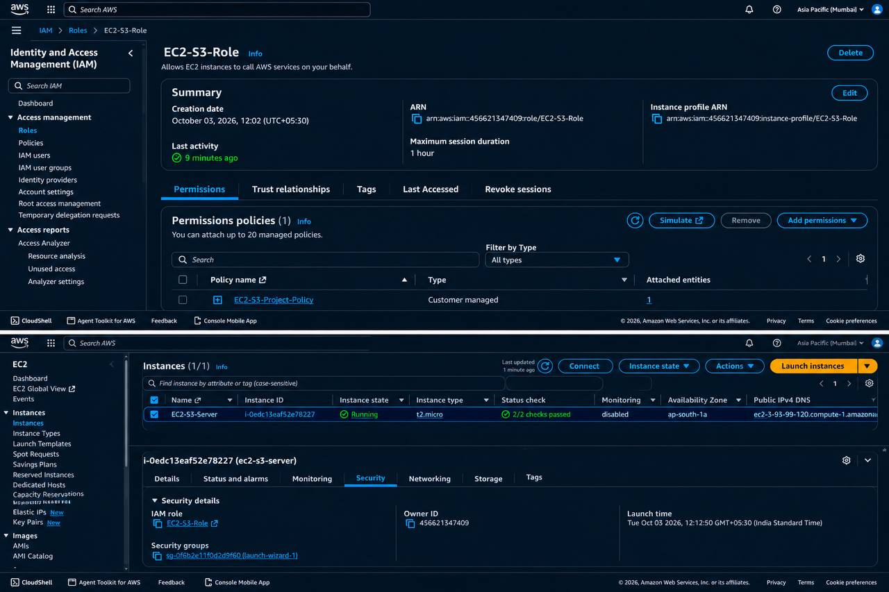
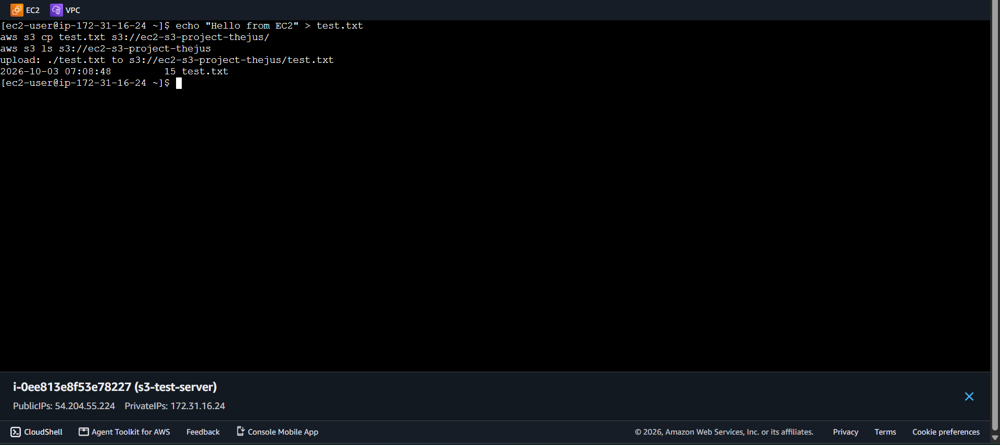
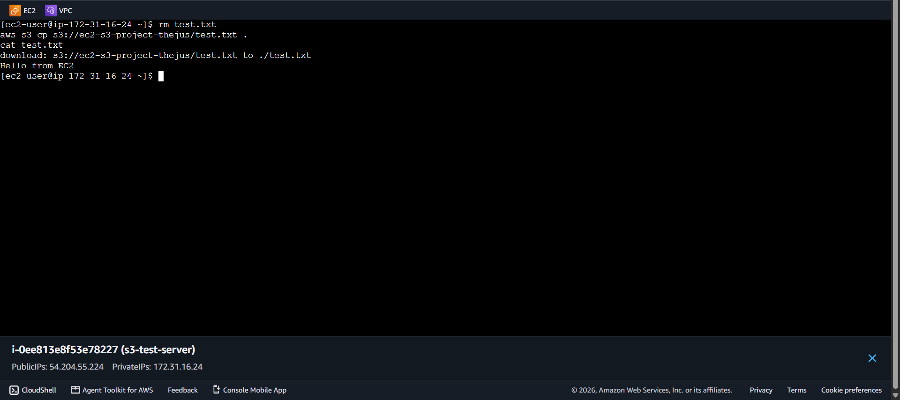
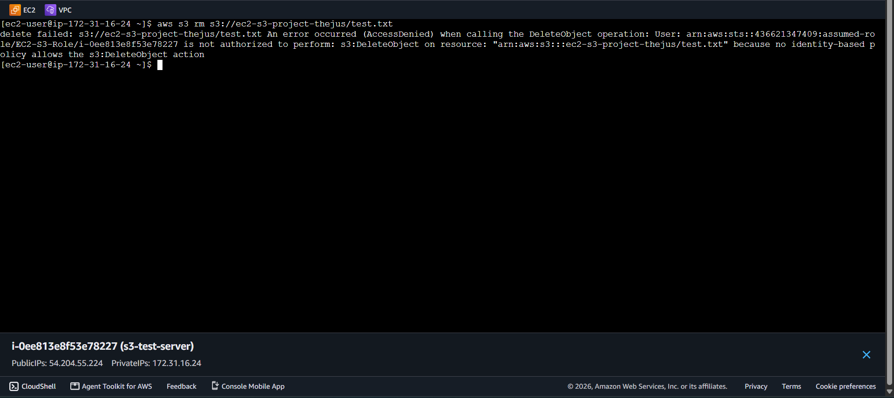

# EC2 + S3 Access Using an IAM Role

## Objective
Show how an EC2 instance securely accesses S3 without storing AWS access keys.

## Architecture
EC2 → IAM Role → S3

## Services Used
EC2, S3, IAM

## Steps
1. Created S3 bucket `ec2-s3-project-thejus`
2. Created IAM policy (see `policy.json`) with `s3:ListBucket`, `s3:GetObject`, `s3:PutObject`
3. Created IAM role `EC2-S3-Role` with EC2 as the trusted entity
4. Launched an Amazon Linux 2023 EC2 instance and attached the role
5. Connected using EC2 Instance Connect
6. Verified identity: `aws sts get-caller-identity`
7. Uploaded a file: `aws s3 cp test.txt s3://ec2-s3-project-thejus/`
8. Downloaded it: `aws s3 cp s3://ec2-s3-project-thejus/test.txt .`

## Screenshots

## Least Privilege Demo
Deleting an object failed with *Access Denied* because `s3:DeleteObject` was never granted to the IAM role `EC2-S3-Role`.
